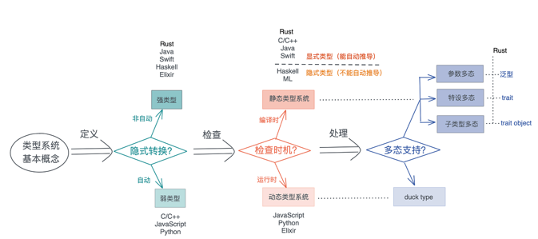
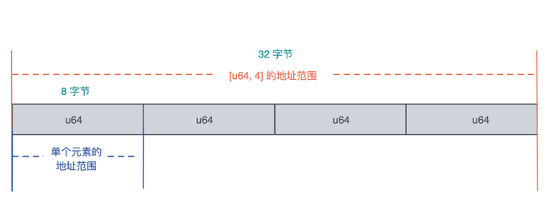
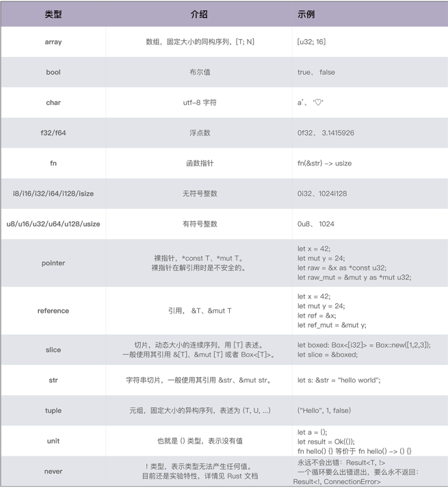
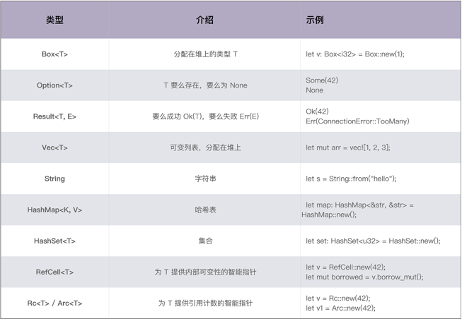
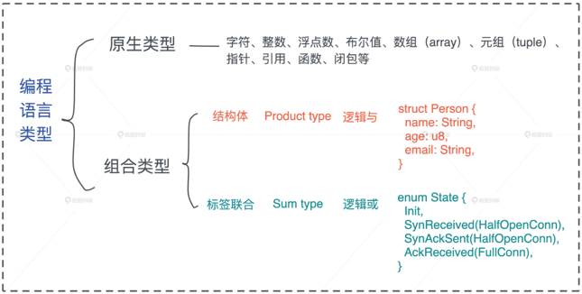

## Rust类型系统
如果你用 C/Golang 这样不支持泛型的静态语言，或者用 Python/Ruby/JavaScript 这样的动态语言，这个部分可能是个难点，希望你做好要转换思维的准备；如果你用 C++/Java/Swift 等支持泛型的静态语言，可以比较一下 Rust 和它们的异同。

作为一门语言的核心要素，类型系统很大程度上塑造了语言的用户体验以及程序的安全性。为什么这么说？因为，在机器码的世界中，没有类型而言，指令仅仅和立即数或者内存打交道，内存中存放的数据都是字节流。

所以，可以说类型系统完全是一种工具，编译器在编译时对数据做静态检查，或者语言在运行时对数据做动态检查的时候，来保证某个操作处理的数据是开发者期望的数据类型。

现在你是不是能理解，为什么 Rust 类型系统对类型问题的检查格外严格（总是报错）。

### 类型系统基本概念与分类
类型，是对值的区分，它包含了值在内存中的长度、对齐以及值可以进行的操作等信息。

比如 u32 类型，它是一个无符号 32 位整数，长度是 4 个字节，对齐也是 4 个字节，取值范围在 0～4G 之间；u32 类型实现了加减乘除、大小比较等接口，所以我们可以做类似 1 + 2、i <= 3 这样的操作。

类型系统其实就是，对类型进行定义、检查和处理的系统。所以，按对类型的操作阶段不同，就有了不同的划分标准，也对应有不同分类，我们一个一个看。

按定义后类型是否可以隐式转换，可以分为强类型和弱类型。Rust 不同类型间不能自动转换，所以是强类型语言，而 C / C++ / JavaScript 会自动转换，是弱类型语言。

按类型检查的时机，在编译时检查还是运行时检查，可以分为静态类型系统和动态类型系统。对于静态类型系统，根据类型是否能够被推导出来，还可以进一步分为显式静态和隐式静态，Rust / Java / Swift 等语言都是显式静态语言，而 Haskell 是隐式静态语言。

在类型系统中，多态是一个非常重要的思想，它是指在使用相同的接口时，不同类型的对象，会采用不同的实现。

对于动态类型系统，多态通过鸭子类型（duck typing）实现；而对于静态类型系统，多态可以通过参数多态（parametric polymorphism）、特设多态（adhoc polymorphisim）和子类型多态（subtype polymorphism）实现。

- 参数多态是指，代码操作的类型是一个满足某些约束的参数，而非具体的类型。

- 特设多态是指同一种行为有多个不同实现的多态。比如加法，可以 1+1，也可以是 “abc” + “cde”、matrix1 + matrix2、甚至 matrix1 + vector1。在面向对象编程语言中，特设多态一般指函数的重载。

- 子类型多态是指，在运行时，子类型可以被当成父类型使用。

在 Rust 中，参数多态通过泛型来支持、特设多态通过 trait 来支持、子类型多态可以用 trait object 来支持。

你可以看下图来更好地厘清这些概念之间的关系：


### Rust 类型系统
按刚才不同阶段的分类，在定义时， Rust 不允许类型的隐式转换，也就是说，Rust 是强类型语言；同时在检查时，Rust 使用了静态类型系统，在编译期保证类型的正确。强类型加静态类型，使得 Rust 是一门类型安全的语言。

其实说到“类型安全”，我们经常听到这个术语，但是你真的清楚它是什么涵义吗？

从内存的角度看，类型安全是指代码，只能按照被允许的方法，访问它被授权访问的内存。

以一个长度为 4，存放 u64 数据的数组为例，访问这个数组的代码，只能在这个数组的起始地址到数组的结束地址之间这片 32 个字节的内存中访问，而且访问是按照 8 字节来对齐的，另外，数组中的每个元素，只能做 u64 类型允许的操作。对此，编译器会对代码进行严格检查来保证这个行为。我们看下图：



所以 C/C++ 这样，定义后数据可以隐式转换类型的弱类型语言，不是内存安全的，而 Rust 这样的强类型语言，是类型安全的，不会出现开发者不小心引入了一个隐式转换，导致读取不正确的数据，甚至内存访问越界的问题。

在此基础上，Rust 还进一步对内存的访问进行了读 / 写分开的授权。所以，Rust 下的内存安全更严格：代码只能按照被允许的方法和被允许的权限，访问它被授权访问的内存。

为了做到这么严格的类型安全，Rust 中除了 let / fn / static / const 这些定义性语句外，都是表达式，而一切表达式都有类型，所以可以说在 Rust 中，类型无处不在。

你也许会有疑问，那类似这样的代码，它的类型是什么？
```rust
if has_work {
    do_something();
}
```

在 Rust 中，对于一个作用域，无论是 if / else / for 循环，还是函数，最后一个表达式的返回值就是作用域的返回值，如果表达式或者函数不返回任何值，那么它返回一个 unit() 。unit 是只有一个值的类型，它的值和类型都是  () 。

像上面这个 if 块，它的类型和返回值是() ，所以当它被放在一个没有返回值的函数中，如下所示：

```rust
fn work(has_work: bool) {
    if has_work {
        do_something();
    }
}
```

Rust 类型无处不在这个逻辑还是自洽的。

unit 的应用非常广泛，除了作为返回值，它还被大量使用在数据结构中，比如  Result<(), Error> 表示返回的错误类型中，我们只关心错误，不关心成功的值，再比如  HashSet 实际上是 HashMap<K, ()> 的一个类型别名。

到这里简单总结一下，我们了解到 Rust 是强类型 / 静态类型语言，并且在代码中，类型无处不在。

作为静态类型语言，Rust 提供了大量的数据类型，但是在使用的过程中，进行类型标注是很费劲的，所以 Rust 类型系统贴心地提供了类型推导。

而对比动态类型系统，静态类型系统还比较麻烦的是，同一个算法，对应输入的数据结构不同，需要有不同的实现，哪怕这些实现没有什么逻辑上的差异。对此，Rust 给出的答案是泛型（参数多态）。

所以接下来，我们先看 Rust 有哪些基本的数据类型，然后了解一下类型推导是如何完成的，最后看 Rust 是如何支持泛型的。

### 数据类型(原生类型和组合类型的定义)
Rust 的原生类型包括字符、整数、浮点数、布尔值、数组（array）、元组（tuple）、切片（slice）、指针、引用、函数等，见下表：


在原生类型的基础上，Rust 标准库还支持非常丰富的组合类型，我们看看迄今为止遇到的：


之后我们不断会遇到新的数据类型，推荐你有意识地记录一下，相信到最后，你的这个列表会积累得很长很长。

另外在 Rust 已有数据类型的基础上，你也可以使用结构体（struct）和标签联合（enum）定义自己的组合类型，之前已经有过详细的介绍，这里就不再赘述，你可以看下图回顾：


### 类型推导
作为静态类型系统的语言，虽然能够在编译期保证类型的安全，但一个很大的不便是，代码撰写起来很繁杂，到处都要进行类型的声明。尤其刚刚讲了 Rust 的数据类型相当多，所以，为了减轻开发者的负担，Rust 支持局部的类型推导。

在一个作用域之内，Rust 可以根据变量使用的上下文，推导出变量的类型，这样我们就不需要显式地进行类型标注了。比如下面这段代码，创建一个 BTreeMap 后，往这个 map 里添加了 key 为 “hello”、value 为 “world” 的值：
```rust
use std::collections::BTreeMap;
fn main() {
    let mut map = BTreeMap::new();
    map.insert("hello", "world");
    println!("map: {:?}", map);
}
```
此时， Rust 编译器可以从上下文中推导出， BTreeMap<K, V> 的类型 K 和 V 都是字符串引用 &str，所以这段代码可以编译通过，然而，如果你把第 5 行这个作用域内的 insert 语句注释去掉，Rust 编译器就会报错：“cannot infer type for type parameter K”。

很明显，Rust 编译器需要足够的上下文来进行类型推导，所以有些情况下，编译器无法推导出合适的类型，比如下面的代码尝试把一个列表中的偶数过滤出来，生成一个新的列表：
```rust
fn main() {
    let numbers = vec![1, 2, 3, 4, 5, 6, 7, 8, 9, 10];
    let even_numbers = numbers
        .into_iter()
        .filter(|n| n % 2 == 0)
        .collect();
    println!("{:?}", even_numbers);
}
```
collect 是 Iterator trait 的方法，它把一个 iterator 转换成一个集合。因为很多集合类型，如 Vec<T>、HashMap<K, V> 等都实现了 Iterator，所以这里的  collect 究竟要返回什么类型，编译器是无法从上下文中推断的。

所以这段代码无法编译，它会给出如下错误：“consider giving even_numbers a type”。

对于这种情况，我们就无法依赖类型推导来简化代码了，必须让 even_numbers 有一个明确的类型。所以，我们可以使用类型声明：
```rust
fn main() {
    let numbers = vec![1, 2, 3, 4, 5, 6, 7, 8, 9, 10];
    let even_numbers: Vec<_> = numbers
        .into_iter()
        .filter(|n| n % 2 == 0)
        .collect();
    println!("{:?}", even_numbers);
}
```

注意这里编译器只是无法推断出集合类型，但集合类型内部元素的类型，还是可以根据上下文得出，所以我们可以简写成  Vec<_> 。

除了给变量一个显式的类型外，我们也可以让 collect 返回一个明确的类型：
```rust
fn main() {
    let numbers = vec![1, 2, 3, 4, 5, 6, 7, 8, 9, 10];
    let even_numbers = numbers
        .into_iter()
        .filter(|n| n % 2 == 0)
        .collect::<Vec<_>>();
    println!("{:?}", even_numbers);
}
```

你可以看到，在泛型函数后使用  ::<T> 来强制使用类型 T，这种写法被称为 turbofish。再看一个对 IP 地址和端口转换的例子：
```rust
use std::net::SocketAddr;
fn main() {
    let addr = "127.0.0.1:8080".parse::<SocketAddr>().unwrap();
    println!("addr: {:?}, port: {:?}", addr.ip(), addr.port());
}
```
turbofish 的写法在很多场景都有优势，因为在某些上下文中，你想直接把一个表达式传递给一个函数或者当成一个作用域的返回值，比如：
```rust
match data {
    Some(s) => v.parse::<User>()?,
    _ => return Err(...),
}
```
如果 User 类型在上下文无法被推导出来，又没有 turbofish  的写法，我们就不得不先给一个局部变量赋值时声明类型，然后再返回，这样代码就变得冗余了。


