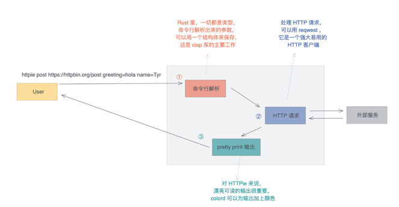

## 需求
- 首先是做命令行解析，处理子命令和各种参数，验证用户的输入，并且将这些输入转换成内部能理解的参数；

- 之后根据解析好的参数，发送一个 HTTP 请求，获得响应；

- 最后用对用户友好的方式输出响应。

## 三方库
- 对于命令行解析，Rust 有很多库可以满足这个需求，今天使用官方比较推荐的 clap。
  
- 对于 HTTP 客户端(reqwest)，使用它的异步接口。
  
- 对于格式化输出，为了让输出像 Python 版本的 httpie 那样显得生动可读，可以引入一个命令终端多彩显示的库，这里选择比较简单的 colored。
  
- 除此之外，还需要一些额外的库：用 anyhow 做错误处理、用 jsonxf 格式化 JSON 响应、用 mime 处理 mime 类型，以及引入 tokio 做异步处理。

## CLI 处理

