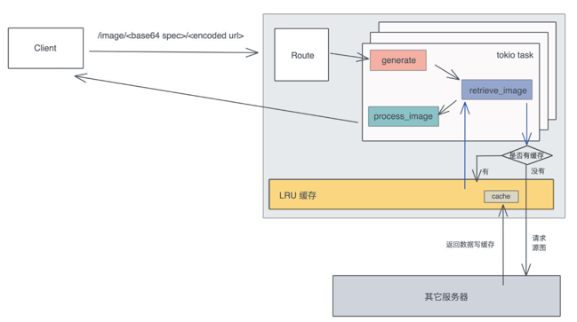

## Thumbor
Thumbor 是 Python 下的一个非常著名的图片服务器，被广泛应用在各种需要动态调整图片尺寸的场合里。

它可以通过一个很简单的 HTTP 接口，实现图片的动态剪切和大小调整，另外还支持文件存储、替换处理引擎等其他辅助功能，非常实用，性能也还不错。

> http://<thumbor-server>/300x200/smart/thumbor.readthedocs.io/en/latest/_images/ -thumbor.png

在这个例子里，Thumbor 可以对这个图片最后的 URL 使用 smart crop 剪切，并调整大小为 300x200 的尺寸输出，用户访问这个 URL 会得到一个 300x200 大小的缩略图。

用Rust来实现它最核心的功能，对图片进行动态转换。

## 设计分析
既然是图片转换，最基本的肯定是要支持各种各样的转换功能，比如调整大小、剪切、加水印，甚至包括图片的滤镜但是，图片转换服务的难点其实在接口设计上，如何设计一套易用、简洁的接口，让图片服务器未来可以很轻松地扩展。

为什么这么说，你想如果有一天，产品经理来找你，突然想让原本只用来做缩略图的图片服务，支持老照片的滤镜效果，你准备怎么办？

Thumbor 给出的答案是，把要使用的处理方法的接口，按照一定的格式、一定的顺序放在 URL 路径中，不使用的图片处理方法就不放：

> /mac/trim/AxB:CxD/(adaptative-)(full-)fit-in/-Ex-F/HALIGN/VALIGN/smart/filters:FILTERNAME(ARGUMENT):FILTERNAME(ARGUMENT)/*IMAGE-URI*

但这样不容易扩展，解析起来不方便，也很难满足对图片做多个有序操作的要求，比如对某个图片我想先加滤镜再加水印，对另一个图片我想先加水印再加滤镜。

另外，如果未来要加更多的参数，一个不小心，还很可能和已有的参数冲突，或者造成 API 的破坏性更新（breaking change）。作为开发者，永远不要低估产品经理那颗什么奇葩想法都有的躁动的心。

所以，在构思这个项目的时候，需要找一种更简洁且可扩展的方式，来描述对图片进行的一系列有序操作，比如说：先做 resize，之后对 resize 的结果添加一个水印，最后统一使用一个滤镜。

这样的有序操作，对应到代码中，可以用列表来表述，列表中每个操作可以是一个 enum，像这样：

```rust
// 解析出来的图片处理的参数
struct ImageSpec {
    specs: Vec<Spec>
}
// 每个参数的是我们支持的某种处理方式
enum Spec {
    Resize(Resize),
    Crop(Crop),
    //...
}
// 处理图片的 resize
struct Resize {
    width: u32,
    height: u32
}
```

现在需要的数据结构有了，刚才分析了 thumbor 使用的方式拓展性不好，那如何设计一个任何客户端可以使用的、体现在 URL 上的接口，使其能够解析成我们设计的数据结构呢？

使用 querystring 么？虽然可行，但它在图片处理步骤比较复杂的时候，容易无序增长，比如要对某个图片做七八次转换，这个 querystring 就会非常长。

这里的思路是使用 protobuf。protobuf 可以描述数据结构，几乎所有语言都有对 protobuf 的支持。

当用 protobuf 生成一个 image spec 后，可以将其序列化成字节流。但字节流无法放在 URL 中，怎么办？可以用 base64 转码！

顺着这个思路，来试着写一下描述 image spec 的 protobuf 消息的定义：

```
message ImageSpec { repeated Spec specs = 1; }
message Spec {
  oneof data {
    Resize resize = 1;
    Crop crop = 2;
    ...
  }
}
...
```

这样就可以在 URL 中，嵌入通过 protobuf  生成的 base64 字符串，来提供可扩展的图片处理参数。处理过的 URL 长这个样子：

> http://localhost:3000/image/CgoKCAjYBBCgBiADCgY6BAgUEBQKBDICCAM/<encoded origin url>

CgoKCAjYBBCgBiADCgY6BAgUEBQKBDICCAM 描述了上面说的图片的处理流程：先做 resize，之后对 resize 的结果添加一个水印，最后统一使用一个滤镜。它可以用下面的代码实现：
```rust
fn print_test_url(url: &str) {
    use std::borrow::Borrow;
    let spec1 = Spec::new_resize(600, 800, resize::SampleFilter::CatmullRom);
    let spec2 = Spec::new_watermark();
    let spec3 = Spec::new_filter(filter::Filter::Marine);
    let image_spec = ImageSpec::new(vec![spec1, spec2, spec3]);
    let s: String = image_spec.borrow().into();
    let test_image = percent_encode(url.as_bytes(), NON_ALPHANUMERIC).to_string();
    println!("test url: http://localhost:3000/image/{}/{}", s, test_image);
}
```

使用 protobuf 的好处是，序列化后的结果比较小巧，而且任何支持 protobuf 的语言都可以生成或者解析这个接口。

接口敲定好，接下来就是做一个 HTTP 服务器提供这个接口。在 HTTP 服务器对 /image 路由的处理流程里，需要从 URL 中获取原始的图片，然后按照 image spec 依次处理，最后把处理完的字节流返回给用户。

在这个流程中，显而易见能够想到的优化是，为原始图片的获取过程，提供一个 LRU（Least Recently Used）缓存，因为访问外部网络是整个路径中最缓慢也最不可控的环节。



## protobuf 的定义和编译
先 “cargo new thumbor” 生成项目，然后在项目的 Cargo.toml 中添加这些依赖：
```toml
[dependencies]
axum = "0.5.13" # web 服务器
anyhow = "1" # 错误处理
base64 = "0.13" # base64 编码/解码
bytes = "1" # 处理字节流
image = "0.24.3" # 处理图片
lazy_static = "1" # 通过宏更方便地初始化静态变量
lru = "0.7.8" # LRU 缓存
percent-encoding = "2" # url 编码/解码
photon-rs = "0.3" # 图片效果
prost = "0.11.0" # protobuf 处理
reqwest = "0.11" # HTTP cliebnt
serde = { version = "1", features = ["derive"] } # 序列化/反序列化数据
tokio = { version = "1", features = ["full"] } # 异步处理
tower = { version = "0.4", features = ["util", "timeout", "load-shed", "limit"] } # 服务处理及中间件
tower-http = { version = "0.3.4", features = ["add-extension", "compression-full", "trace" ] } # http 中间件
tracing = "0.1" # 日志和追踪
tracing-subscriber = "0.3.15" # 日志和追踪

[build-dependencies]
prost-build = "0.11.0" # 编译 protobuf
```

在项目根目录下，生成一个 abi.proto 文件，写入支持的图片处理服务用到的数据结构：
```protobuf
syntax = "proto3";
package abi; // 这个名字会被用作编译结果，prost 会产生：abi.rs
// 一个 ImageSpec 是一个有序的数组，服务器按照 spec 的顺序处理
message ImageSpec { repeated Spec specs = 1; }
// 处理图片改变大小
message Resize {
  uint32 width = 1;
  uint32 height = 2;
  enum ResizeType {
    NORMAL = 0;
    SEAM_CARVE = 1;
  }
  ResizeType rtype = 3;
  enum SampleFilter {
    UNDEFINED = 0;
    NEAREST = 1;
    TRIANGLE = 2;
    CATMULL_ROM = 3;
    GAUSSIAN = 4;
    LANCZOS3 = 5;
  }
  SampleFilter filter = 4;
}
// 处理图片截取
message Crop {
  uint32 x1 = 1;
  uint32 y1 = 2;
  uint32 x2 = 3;
  uint32 y2 = 4;
}
// 处理水平翻转
message Fliph {}
// 处理垂直翻转
message Flipv {}
// 处理对比度
message Contrast { float contrast = 1; }
// 处理滤镜
message Filter {
  enum Filter {
    UNSPECIFIED = 0;
    OCEANIC = 1;
    ISLANDS = 2;
    MARINE = 3;
    // more: https://docs.rs/photon-rs/0.3.1/photon_rs/filters/fn.filter.html
  }
  Filter filter = 1;
}
// 处理水印
message Watermark {
  uint32 x = 1;
  uint32 y = 2;
}
// 一个 spec 可以包含上述的处理方式之一
message Spec {
  oneof data {
    Resize resize = 1;
    Crop crop = 2;
    Flipv flipv = 3;
    Fliph fliph = 4;
    Contrast contrast = 5;
    Filter filter = 6;
    Watermark watermark = 7;
  }
}
```

这包含了支持的图片处理服务，以后可以轻松扩展它来支持更多的操作。

protobuf 是一个向下兼容的工具，所以在服务器不断支持更多功能时，还可以和旧版本的客户端兼容。

在 Rust 下，可以用 prost 来使用和编译 protobuf。同样，在项目根目录下，创建一个 build.rs，写入以下代码：
```rust
fn main() {
    prost_build::Config::new()
        .out_dir("src/pb")
        .compile_protos(&["abi.proto"], &["."])
        .unwrap();
}
```

build.rs 可以在编译 cargo 项目时，做额外的编译处理。这里使用 prost_build 把 abi.proto 编译到 src/pb 目录下。

这个目录现在还不存在，你需要  mkdir src/pb 创建它。运行  cargo build，你会发现在 src/pb 下，有一个 abi.rs 文件被生成出来，这个文件包含了从 protobuf 消息转换出来的 Rust 数据结构。先不用管 prost 额外添加的各种标记宏，就把它们当成普通的数据结构使用即可。

接下来，创建 src/pb/mod.rs，一个目录下的所有代码，可以通过 mod.rs 声明。在这个文件中，引入 abi.rs，并且撰写一些辅助函数。这些辅助函数主要是为了，让 ImageSpec 可以被方便地转换成字符串，或者从字符串中恢复。

另外，还写了一个测试确保功能的正确性，你可以  cargo test 测试一下。记得在 main.rs 里添加  mod pb; 引入这个模块。

## 引入 HTTP 服务器
处理完和 protobuf  相关的内容，来处理 HTTP 服务的流程。

Rust 社区有很多高性能的 Web 服务器，比如actix-web 、rocket 、warp ，以及最近新出的 axum。来用新鲜出炉的 axum 做这个服务器。

根据 axum 的文档，可以构建 main.rs。
```rust
use axum::{extract::Path, http::StatusCode, routing::get, Router};
use percent_encoding::percent_decode_str;
use serde::Deserialize;
use std::convert::TryInto;
use tracing_subscriber::fmt::format;

// 引入 protobuf 生成的代码，暂且不用太关心
mod pb;
use pb::*;

// 参数使用 serde 做 Deserialize，axum 会自动识别并解析
#[derive(Deserialize)]
struct Params {
    spec: String,
    url: String,
}

#[tokio::main]
async fn main() {
    // 初始化 tracing
    tracing_subscriber::fmt::init();

    // 构建路由
    let app = Router::new().route("/image/:spec/:url", get(generate));

    // 运行web服务器
    let addr = "127.0.0.1:3000".parse().unwrap();
    tracing::debug!("listening on {}", addr);
    axum::Server::bind(&addr)
        .serve(app.into_make_service())
        .await
        .unwrap();
}

// 先吧参数解析出来
async fn generate(Path(Params { spec, url }): Path<Params>) -> Result<String, StatusCode> {
    let url = percent_decode_str(&url).decode_utf8_lossy();
    let specParse: ImageSpec = spec
        .as_str()
        .try_into()
        .map_err(|_| StatusCode::BAD_REQUEST)?;
    Ok(format!("url: {}\n spec: {:#?}", url, spec))
}
```

添加到 main.rs 后，使用  cargo run 运行服务器，然后就可以用另一个工具 HTTPie 测试（eat your own dog food）。

> httpie get "http://localhost:3000/image/CgoKCAjYBBCgBiADCgY6BAgUEBQKBDICCAM/https%3A%2F%2Fimages%2Epexels%2Ecom%2Fphotos%2F2470905%2Fpexels%2Dphoto%2D2470905%2Ejpeg%3Fauto%3Dcompress%26cs%3Dtinysrgb%26dpr%3D2%26h%3D750%26w%3D1260"

## 获取源图并缓存
根据之前的设计，需要引入 LRU cache 来缓存源图。一般 Web 框架都会有中间件来处理全局的状态，axum 也不例外，可以使用 AddExtensionLayer 添加一个全局的状态，这个状态目前就是 LRU cache，在内存中缓存网络请求获得的源图。

把 main.rs 的代码，改成下面的代码：
```text
use anyhow::Result;
use axum::{
    extract::{Extension, Path},
    http::{HeaderMap, HeaderValue, StatusCode},
    routing::get, Router,
};
use bytes::Bytes;
use lru::LruCache;
use percent_encoding::{percent_decode_str, percent_encode, NON_ALPHANUMERIC};
use serde::Deserialize;
use std::{
    collections::hash_map::DefaultHasher,
    convert::TryInto,
    hash::{Hash, Hasher},
    sync::Arc,
};
use std::borrow::Borrow;
use std::time::Duration;
use tokio::sync::Mutex;
use tower::ServiceBuilder;
use tower_http::add_extension::AddExtensionLayer;
use tower_http::compression::CompressionLayer;
use tower_http::trace::TraceLayer;
use tracing::{info, instrument};
// 引入 protobuf 生成的代码，暂且不用太关心
mod pb;
use pb::*;

// 参数使用 serde 做 Deserialize，axum 会自动识别并解析
#[derive(Deserialize)]
struct Params {
    spec: String,
    url: String,
}

type Cache = Arc<Mutex<LruCache<u64, Bytes>>>;

#[tokio::main]
async fn main() {
    // 初始化 tracing
    tracing_subscriber::fmt::init();
    let cache: Cache = Arc::new(Mutex::new(LruCache::new(1024)));

    // 构建路由
    let app = Router::new()
        // `GET /` 会执行
        .route("/image/:spec/:url", get(generate))
        .layer(
            ServiceBuilder::new()
                //.load_shed()
                //.concurrency_limit(1024)
                //.timeout(Duration::from_secs(10))
                .layer(TraceLayer::new_for_http())
                .layer(AddExtensionLayer::new(cache))
                .layer(CompressionLayer::new())
                .into_inner(),
        );

    // 运行 web 服务器
    let addr = "127.0.0.1:3000".parse().unwrap();
    print_test_url("https://images.pexels.com/photos/1562477/pexels-photo-1562477.jpeg?auto=compress&cs=tinysrgb&dpr=3&h=750&w=1260");
    tracing::debug!("listening on {}", addr);
    axum::Server::bind(&addr)
        .serve(app.into_make_service())
        .await
        .unwrap();
}

// 先吧参数解析出来
async fn generate(
    Path(Params { spec, url }): Path<Params>,
    Extension(cache): Extension<Cache>,
) -> Result<(HeaderMap, Vec<u8>), StatusCode> {
    let url = &percent_decode_str(&url).decode_utf8_lossy();
    let spec: ImageSpec = spec
        .as_str()
        .try_into()
        .map_err(|_| StatusCode::BAD_REQUEST)?;
    let data = retrieve_image(&url, cache)
        .await
        .map_err(|_| StatusCode::BAD_REQUEST)?;

    //TODO: 处理图片信息
    let mut headers = HeaderMap::new();
    headers.insert("content-type", HeaderValue::from_static("image/jpeg"));
    Ok((headers, data.to_vec()))
}

#[instrument(level = "info", skip(cache))]
async fn retrieve_image(url: &str, cache: Cache) -> Result<Bytes> {
    let mut hasher = DefaultHasher::new();
    url.hash(&mut hasher);
    let key = hasher.finish();

    let g = &mut cache.lock().await;
    let data = match g.get(&key) {
        Some(v) => {
            info!("Match cache {}", key);
            v.to_owned()
        }
        None => {
            info!("Retrieve url");
            let resp = reqwest::get(url).await?;
            let data = resp.bytes().await?;
            g.put(key, data.clone());
            data
        }
    };

    Ok(data)
}

// 调试辅助函数
fn print_test_url(url: &str) {
    let spec1 = Spec::new_resize(500, 800, resize::SampleFilter::CatmullRom);
    let spec2  = Spec::new_watermark(50,50);
    let spec3 = Spec::new_filter(filter::Filter::Marine);
    let image_spec = ImageSpec::new(vec![spec1, spec2,spec3]);
    let s: String = image_spec.borrow().into();
    let test_image = percent_encode(url.as_bytes(), NON_ALPHANUMERIC).to_string();
    println!("test url: http://localhost:3000/image/{}/{}", s, test_image);
}
```

主要就是添加了 retrieve_image 这个函数。对于图片的网络请求，我们先把 URL 做个哈希，在 LRU 缓存中查找，找不到才用 reqwest 发送请求。

> RUST_LOG=info cargo run --quiet

## 图片处理
接下来就可以处理图片了，Rust 下有一个不错的、偏底层的 image 库，围绕它有很多上层的库，包括今天要使用 photon_rs。

扫了一下它的源代码，感觉它不算一个特别优秀的库，内部有太多无谓的内存拷贝，所以性能还有不少提升空间。

就算如此，从 photon_rs 自己的 benchmark 看，也比 PIL / ImageMagick 性能好太多，这也算是 Rust 性能强大的一个小小佐证吧。

因为 photo_rs 使用简单，这里也不太关心更高的性能，就暂且用它。然而，作为一个有追求的开发者，知道，有朝一日可能要用不同的 image 引擎替换它，所以设计一个 Engine trait：
```rust
// Engine trait：未来可以添加更多的 engine，主流程只需要替换 engine
pub trait Engine {
    // 对 engine 按照 specs 进行一系列有序的处理
    fn apply(&mut self, specs: &[Spec]);
    // 从 engine 中生成目标图片，注意这里用的是 self，而非 self 的引用
    fn generate(self, format: ImageOutputFormat) -> Vec<u8>;
}
```

它提供两个方法，apply 方法对 engine 按照 specs 进行一系列有序的处理，generate 方法从 engine 中生成目标图片。

那么 apply 方法怎么实现呢？可以再设计一个 trait，这样可以为每个 Spec 生成对应处理：
```rust
// SpecTransform：未来如果添加更多的 spec，只需要实现它即可
pub trait SpecTransform<T> {
    // 对图片使用 op 做 transform
    fn transform(&mut self, op: T);
}
```

创建 src/engine 目录，并添加 src/engine/mod.rs，在这个文件里添加对 trait 的定义：
```rust
use crate::pb::Spec;
use image::ImageOutputFormat;
mod photon;
pub use photon::Photon;
// Engine trait：未来可以添加更多的 engine，主流程只需要替换 engine
pub trait Engine {
    // 对 engine 按照 specs 进行一系列有序的处理
    fn apply(&mut self, specs: &[Spec]);
    // 从 engine 中生成目标图片，注意这里用的是 self，而非 self 的引用
    fn generate(self, format: ImageOutputFormat) -> Vec<u8>;
}
// SpecTransform：未来如果添加更多的 spec，只需要实现它即可
pub trait SpecTransform<T> {
    // 对图片使用 op 做 transform
    fn transform(&mut self, op: T);
}
```

接下来生成一个文件 src/engine/photon.rs，对 photon 实现 Engine trait。
```rust
use super::{Engine, SpecTransform};
use crate::pb::*;
use anyhow::Result;
use bytes::Bytes;
use image::{DynamicImage, ImageBuffer, ImageOutputFormat};
use lazy_static::lazy_static;
use photon_rs::{
    effects, filters, multiple, native::open_image_from_bytes, transform, PhotonImage,
};
use std::convert::TryFrom;
lazy_static! {
    // 预先把水印文件加载为静态变量
    static ref WATERMARK: PhotonImage = {
        // 这里你需要把我 github 项目下的对应图片拷贝到你的根目录
        // 在编译的时候 include_bytes! 宏会直接把文件读入编译后的二进制
        let data = include_bytes!("../../rust- .png");
        let watermark = open_image_from_bytes(data).unwrap();
        transform::resize(&watermark, 64, 64, transform::SamplingFilter::Nearest)
    };
}
// 我们目前支持 Photon engine
pub struct Photon(PhotonImage);
// 从 Bytes 转换成 Photon 结构
impl TryFrom<Bytes> for Photon {
    type Error = anyhow::Error;
    fn try_from(data: Bytes) -> Result<Self, Self::Error> {
        Ok(Self(open_image_from_bytes(&data)?))
    }
}
impl Engine for Photon {
    fn apply(&mut self, specs: &[Spec]) {
        for spec in specs.iter() {
            match spec.data {
                Some(spec::Data::Crop(ref v)) => self.transform(v),
                Some(spec::Data::Contrast(ref v)) => self.transform(v),
                Some(spec::Data::Filter(ref v)) => self.transform(v),
                Some(spec::Data::Fliph(ref v)) => self.transform(v),
                Some(spec::Data::Flipv(ref v)) => self.transform(v),
                Some(spec::Data::Resize(ref v)) => self.transform(v),
                Some(spec::Data::Watermark(ref v)) => self.transform(v),
                // 对于目前不认识的 spec，不做任何处理
                _ => {}
            }
        }
    }
    fn generate(self, format: ImageOutputFormat) -> Vec<u8> {
        image_to_buf(self.0, format)
    }
}
impl SpecTransform<&Crop> for Photon {
    fn transform(&mut self, op: &Crop) {
        let img = transform::crop(&mut self.0, op.x1, op.y1, op.x2, op.y2);
        self.0 = img;
    }
}
impl SpecTransform<&Contrast> for Photon {
    fn transform(&mut self, op: &Contrast) {
        effects::adjust_contrast(&mut self.0, op.contrast);
    }
}
impl SpecTransform<&Flipv> for Photon {
    fn transform(&mut self, _op: &Flipv) {
        transform::flipv(&mut self.0)
    }
}
impl SpecTransform<&Fliph> for Photon {
    fn transform(&mut self, _op: &Fliph) {
        transform::fliph(&mut self.0)
    }
}
impl SpecTransform<&Filter> for Photon {
    fn transform(&mut self, op: &Filter) {
        match filter::Filter::from_i32(op.filter) {
            Some(filter::Filter::Unspecified) => {}
            Some(f) => filters::filter(&mut self.0, f.to_str().unwrap()),
            _ => {}
        }
    }
}
impl SpecTransform<&Resize> for Photon {
    fn transform(&mut self, op: &Resize) {
        let img = match resize::ResizeType::from_i32(op.rtype).unwrap() {
            resize::ResizeType::Normal => transform::resize(
                &mut self.0,
                op.width,
                op.height,
                resize::SampleFilter::from_i32(op.filter).unwrap().into(),
            ),
            resize::ResizeType::SeamCarve => {
                transform::seam_carve(&mut self.0, op.width, op.height)
            }
        };
        self.0 = img;
    }
}
impl SpecTransform<&Watermark> for Photon {
    fn transform(&mut self, op: &Watermark) {
        multiple::watermark(&mut self.0, &WATERMARK, op.x, op.y);
    }
}
// photon 库竟然没有提供在内存中对图片转换格式的方法，只好手工实现
fn image_to_buf(img: PhotonImage, format: ImageOutputFormat) -> Vec<u8> {
    let raw_pixels = img.get_raw_pixels();
    let width = img.get_width();
    let height = img.get_height();
    let img_buffer = ImageBuffer::from_vec(width, height, raw_pixels).unwrap();
    let dynimage = DynamicImage::ImageRgba8(img_buffer);
    let mut buffer = Vec::with_capacity(32768);
    dynimage.write_to(&mut buffer, format).unwrap();
    buffer
}
```
图片处理引擎就搞定了，这里用了一个水印图片，同样把 engine  模块加入 main.rs，并引入 Photon：
```rust
mod engine;
use engine::{Engine, Photon};
use image::ImageOutputFormat;
```

还记得 src/main.rs 的代码中，留了一个 TODO 么？
```
//TODO: 处理图片信息
let mut headers = HeaderMap::new();
headers.insert("content-type", HeaderValue::from_static("image/jpeg"));
Ok((headers, data.to_vec()))
```

把这段替换掉，使用刚才写好的 Photon 引擎处理：
```text
// 使用 image engine 处理
let mut engine: Photon = data
    .try_into()
    .map_err(|_| StatusCode::INTERNAL_SERVER_ERROR)?;
engine.apply(&spec.specs);
let image = engine.generate(ImageOutputFormat::Jpeg(85));
info!("Finished processing: image size {}", image.len());
let mut headers = HeaderMap::new();
headers.insert("content-type", HeaderValue::from_static("image/jpeg"));
Ok((headers, image))
```

在网上随手找了一张图片来测试下效果。用  cargo build --release 编译 thumbor 项目，然后打开日志运行：
> RUST_LOG=info target/release/thumbor

打开测试链接，在浏览器中可以看到左下角的处理后图片
> http://localhost:3000/image/CgoKCAj0AxCgBiADCgY6BAgyEDIKBDICCAM/https%3A%2F%2Fimages%2Epexels%2Ecom%2Fphotos%2F1562477%2Fpexels%2Dphoto%2D1562477%2Ejpeg%3Fauto%3Dcompress%26cs%3Dtinysrgb%26dpr%3D3%26h%3D750%26w%3D1260

```text
fufeng@magic ~/s/r/p/rust-action>RUST_LOG=info target/release/thumbor                                                                                130 master!+
test url: http://localhost:3000/image/CgoKCAj0AxCgBiADCgY6BAgyEDIKBDICCAM/https%3A%2F%2Fimages%2Epexels%2Ecom%2Fphotos%2F1562477%2Fpexels%2Dphoto%2D1562477%2Ejpeg%3Fauto%3Dcompress%26cs%3Dtinysrgb%26dpr%3D3%26h%3D750%26w%3D1260
2022-08-05T07:24:17.380358Z  INFO retrieve_image{url="https://images.pexels.com/photos/1562477/pexels-photo-1562477.jpeg?auto=compress&cs=tinysrgb&dpr=3&h=750&w=1260"}: thumbor: Retrieve url
2022-08-05T07:24:20.192044Z  INFO thumbor: Finished processing: image size 52314
2022-08-05T07:24:27.983114Z  INFO retrieve_image{url="https://images.pexels.com/photos/1562477/pexels-photo-1562477.jpeg?auto=compress&cs=tinysrgb&dpr=3&h=750&w=1260"}: thumbor: Match cache 13782279907884137652
2022-08-05T07:24:28.306702Z  INFO thumbor: Finished processing: image size 52314
```

这个版本目前是一个没有详细优化过的版本，性能已经足够好。而且，像 Thumbor 这样的图片服务，前面还有 CDN（Content Distribution Network）扛压力，只有 CDN 需要回源时，才会访问到，所以也可以不用太优化。

如果不算 protobuf 生成的代码，Thumbor 这个项目，到目前为止写了 318 行代码：
> tokei src/main.rs src/engine/* src/pb/mod.rs

```text
fufeng@magic ~/s/r/p/r/thumbor>tokei src/main.rs src/engine/* src/pb/mod.rs                                                                              master!+
===============================================================================
 Language            Files        Lines         Code     Comments       Blanks
===============================================================================
 Rust                    4          402          318           29           55
===============================================================================
 Total                   4          402          318           29           55
===============================================================================
```

三百多行代码就把一个图片服务器的核心部分搞定了，不仅如此，还充分考虑到了架构的可扩展性，用 trait 实现了主要的图片处理流程，并且引入了缓存来避免不必要的网络请求。虽然比我们预期的 200 行代码多了 50% 的代码量，但我相信它进一步佐证了 Rust 强大的表达能力。

而且，通过合理使用 protobuf 定义接口和使用 trait 做图片引擎，未来添加新的功能非常简单，可以像搭积木一样垒上去，不会影响已有的功能，完全符合开闭原则（Open-Closed Principle）。

## 结尾
作为一门系统级语言，Rust 使用独特的内存管理方案，零成本地帮我们管理内存；作为一门高级语言，Rust 提供了足够强大的类型系统和足够完善的标准库，帮我们很容易写出低耦合、高内聚的代码。

通过 Engine trait 分离了具体的图片处理引擎和主流程，让主流程变得干净清爽；同时在处理 protobuf 生成的数据结构时，大量使用了 From/ TryFromtrait 做数据类型的转换，也是一种解耦（关注点分离）的思路。

听我讲得这么流畅，你是不是觉得我写的时候肯定不会犯错。其实并没有，我在用 axum 写源图获取的流程时，就因为使用 Mutex 的错误而被编译器毒打，花了些时间才解决。

但这种毒打是非常让人心悦诚服且快乐的，因为我知道，这样的并发问题一旦泄露到生产环境，解决起来大概率会毫无头绪，只能一点点试错可能有问题的代码，那个时候代价就远非和编译器搏斗的这十来分钟可比了。

所以只要你入了门，写 Rust 代码的过程绝对是一种享受，绝大多数错误在编译时就被揪出来了，你的代码只要编译能通过，基本上不需要担心它运行时的正确性。

## 图片处理库
- 你可以直接在 image 库上实现

- 使用 imagemagick: https://github.com/nlfiedler/magick-rust

- 使用 opencv: https://github.com/twistedfall/opencv-rust

- 使用 piet: https://github.com/linebender/piet

- 或者任何 C/C++ image 库（需要做一下 rust binding）
